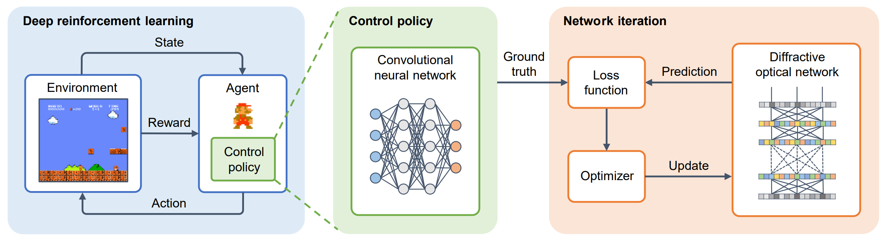

# Decision-making and control with diffractive optical networks

## Abstract
The ultimate goal of artificial intelligence is to mimic the human brain to perform decision-making and control directly from high-dimensional sensory input. Diffractive optical networks provide a promising solution for implementing artificial intelligence with high-speed and low-power consumption. Most of the reported diffractive optical networks focus on single or multiple tasks that do not involve environmental interaction, such as object recognition and image classification. In contrast, the networks capable of performing decision-making and control have not yet been developed to our knowledge. Here, we propose using deep reinforcement learning to implement diffractive optical networks that imitate human-level decision-making and control capability. Such networks taking advantage of a residual architecture, allow for finding optimal control policies through interaction with the environment and can be readily implemented with existing optical devices. The superior performance of these networks is verified by engaging three types of classic games, Tic-Tac-Toe, Super Mario Bros., and Car Racing, and achieving the same or even higher levels comparable to human players. Finally, we present an experimental demonstration of playing Tic-Tac-Toe by leveraging diffractive optical networks based on a spatial light modulator. Our work represents a solid step forward in advancing diffractive optical networks, which promises a fundamental shift from the target-driven control of a pre-designed state for simple recognition or classification tasks to the high-level sensory capability of artificial intelligence. It may find exciting applications in autonomous driving, intelligent robots, and intelligent manufacturing.

## Model

Figure 1: Framework of our proposed method. 

## Usage

1. Run `policy.py` to obtain the policy model.
2. Run `train.py` to train the diffractive optical network.
3. Run `run.py` to load the trained network to play the game.

## Citation

```
@misc{qiu2022decisionmaking,
      title={Decision-making and control with metasurface-based diffractive neural networks}, 
      author={Jumin Qiu and Tianbao Yu and Lujun Huang and Andrey Miroshnichenko and Shuyuan Xiao},
      year={2022},
      eprint={2212.11278},
      archivePrefix={arXiv},
      primaryClass={cs.LG}
}
``` 
